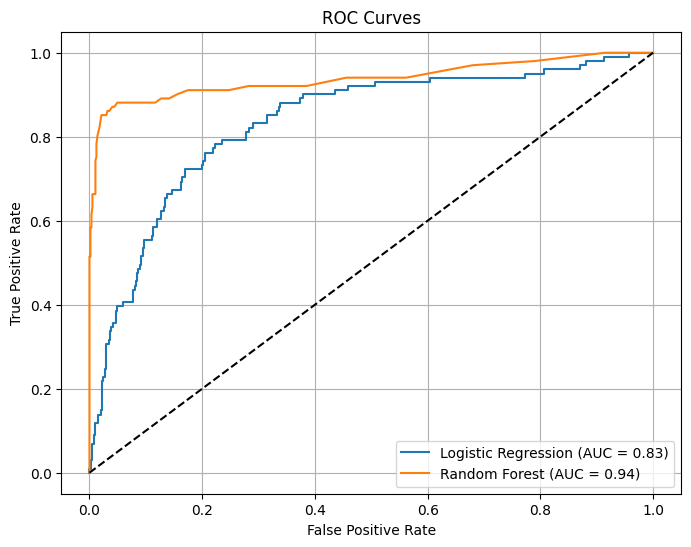

# SyriaTel Customer Churn Prediction

  

  <b>Author:</b> <a href="mailto:joshenkis@gmail.com">Joackim Kisienya</a>

## Overview

Customer churn is a critical issue for telecommunication companies like SyriaTel, as losing existing customers is more costly than acquiring new ones. This project aims to predict customer churn and identify key factors contributing to it, enabling SyriaTel to develop effective retention strategies.

---

## Business and Data Understanding

### Stakeholder Audience

This analysis is intended for SyriaTel’s business managers, data analysts, and decision-makers who need actionable insights to reduce churn and improve customer retention.

### Business Problem

SyriaTel is experiencing high customer churn, threatening revenue stability and market competitiveness. The company needs to:
- Predict which customers are likely to churn.
- Identify at-risk customers.
- Understand the main drivers of churn to inform retention strategies.

### Dataset Choice

The dataset, sourced from [Kaggle](https://www.kaggle.com/datasets/becksddf/churn-in-telecoms-dataset?resource=download), contains customer usage patterns, service plans, and churn labels.

#### Description After Cleaning

After cleaning, the dataset includes only informative features relevant for churn prediction:
- **Removed columns**: `state`, `area code`, and `phone number` (non-informative for modeling).
- **No missing values or duplicates**: The dataset is complete and unique.
- **Categorical columns mapped to binary**: 
  - `international plan` and `voice mail plan` are encoded as 1 (yes) and 0 (no).
  - `churn` is encoded as 1 (churned) and 0 (not churned).
- **Final features**: Usage statistics (minutes, charges), service plans, customer service calls, and voicemail messages.

---

## Exploratory Data Analysis & Visualizations

### Relationship Between Numerical Columns and Churn

- **Boxplots** were used to visualize how features like `total day minutes`, `total day charge`, `customer service calls`, `total intl charge`, and `number vmail messages` differ between churners and non-churners.
- **Interpretation**: Churners tend to have higher daytime usage and charges, contact customer service more frequently, and use voicemail less.

### Relationship Between Categorical Columns and Churn

- **Count plots** were created for `international plan` and `voice mail plan` against churn.
- **Interpretation**: Customers with an international plan are more likely to churn, while those with a voicemail plan are less likely to churn.

### Correlation Visualization

- A **correlation heatmap** was generated to show relationships between all features and churn.
- **Interpretation**: Churn is positively correlated with customer service calls, total day minutes/charge, and international plan, and negatively correlated with voicemail plan and number of voice messages.

---

## Modeling

### Feature Engineering

- Predictors: All relevant numerical and categorical columns after cleaning.
- Target: `churn` (binary).

### Data Preparation

- Features were scaled using `StandardScaler`.
- Data was split into training and testing sets (80/20 split).

### Model Selection

Two models were used:
1. **Logistic Regression**: Chosen as a baseline due to its interpretability and suitability for binary classification.
2. **Random Forest**: Selected for its ability to capture complex relationships and provide feature importance scores.

---

## Evaluation

### Logistic Regression

- **Strengths**: Good at identifying non-churners (high true negatives).
- **Weaknesses**: Low recall for churners (misses many actual churners).
- **AUC**: 0.84, indicating good class separation, but threshold tuning is needed for better recall.

### Random Forest

- **Strengths**: High accuracy for both churners and non-churners, low false positives, and high true positives.
- **AUC**: 0.94, showing excellent ability to distinguish between classes.
- **Feature Importance**: Usage behavior, customer support interactions, and billing features are key drivers of churn.

---

## Model Visualizations

### Feature Importance

- **Bar plots** of feature importances from the Random Forest model highlight which variables most influence churn.
- **Interpretation**: Features related to customer usage and support interactions are the most predictive of churn.

### ROC Curves

- **ROC curves** were plotted for both models to visualize their ability to distinguish between churners and non-churners.

- **Interpretation**: The Random Forest model’s ROC curve rises steeply toward the top-left corner, with an AUC of 0.94, indicating excellent performance. Logistic Regression’s AUC is 0.84, showing good but less optimal separation.

---

## Conclusion

- **Random Forest Classifier** is the preferred model for deployment due to its superior performance and actionable insights.
- Data-driven modeling can effectively identify at-risk customers.
- Understanding feature importance helps tailor business strategies.
- Random Forest methodology is robust and can be adapted for similar churn prediction problems 
  in other industries.
---